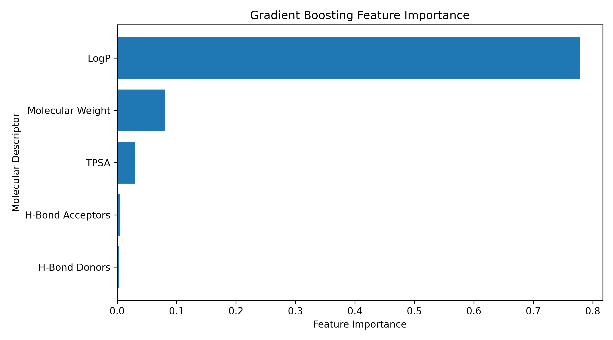
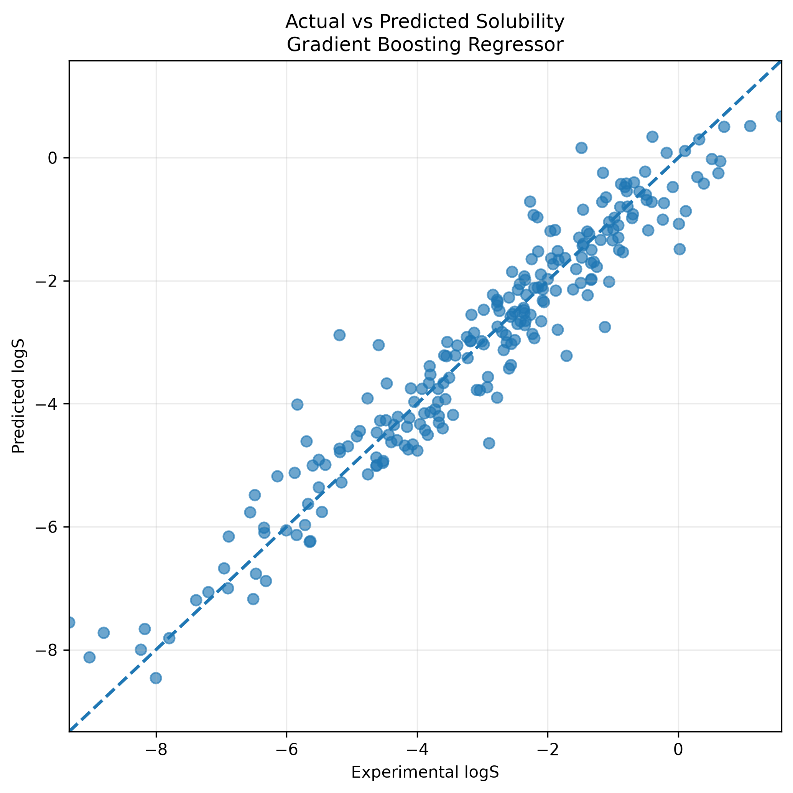
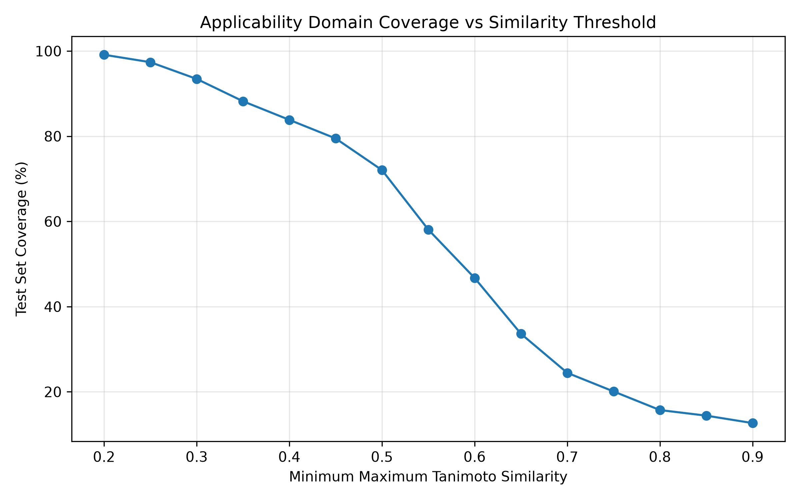

# 🧪 Molecular Solubility Prediction using Machine Learning

Predicting aqueous solubility (logS) of small molecules from their SMILES structure, using RDKit molecular descriptors, Morgan fingerprints, and a tuned Gradient Boosting model — served through an interactive Streamlit app.

**🚀 [Live Demo](https://molsol.streamlit.app/)**

---

## Overview

Aqueous solubility (logS = log₁₀ of solubility in mol/L) is a key property in drug discovery, environmental chemistry, and formulation science. This project builds a supervised ML pipeline that:

1. Converts a molecule (SMILES) into numerical features (descriptors + fingerprint)
2. Predicts logS with a tuned Gradient Boosting Regressor
3. Reports an **Applicability Domain (AD)** confidence score based on structural similarity to the training set, so predictions are never presented without context on how trustworthy they are

The trained model and Streamlit app are the source of truth for the current state of the project; the `src/` scripts document how that model was produced and validated.

---

## Key Features

- Three ways to input a molecule: draw it, name it, or paste a SMILES string
- 517-feature representation: 5 RDKit descriptors + 512-bit Morgan fingerprint
- Gradient Boosting Regressor, tuned via 5-fold cross-validated random search
- Applicability Domain check (Tanimoto similarity) with an empirically validated confidence threshold
- Full offline analysis pipeline (feature importance, SHAP, error analysis, AD threshold validation) with saved results/figures

---

## Dataset

**Delaney ESOL** aqueous solubility dataset — `data/delaney.xlsx`

| | |
|---|---|
| Molecules | 1,144 |
| Input | SMILES string |
| Target | `measured log` (experimental logS, mol/L) |

---

## Feature Engineering

Each molecule is converted into a 517-dimensional feature vector:

- **5 RDKit descriptors:** Molecular Weight, LogP, H-Bond Donors, H-Bond Acceptors, TPSA
- **512-bit Morgan fingerprint** (radius = 2), via `rdkit.Chem.rdFingerprintGenerator.GetMorganGenerator`

The same featurization logic is used for training (`src/model.py`), runtime prediction (`src/predict.py`), and the Applicability Domain check (`src/applicability.py`), so what the model was trained on is exactly what it sees at inference time.

**Feature importance (Gradient Boosting):**



LogP dominates, consistent with its known role as a primary driver of aqueous solubility; the Morgan fingerprint bits contribute the remaining structural signal not captured by the five descriptors above.

---

## Model & Performance

`src/model.py` trains and compares Linear Regression, Random Forest, and Gradient Boosting baselines, runs 5-fold cross-validation, and tunes the best-performing model with `RandomizedSearchCV`. The final model is a **tuned `GradientBoostingRegressor`**, saved as `models/model.pkl`.

| Metric | Value |
|---|---|
| Test RMSE | 0.5964 |
| Test MAE | 0.4553 |
| Test R² | 0.9183 |



---

## Applicability Domain

A numerical prediction is only meaningful if the query molecule resembles something the model was actually trained on. For every prediction, `src/applicability.py` computes:

- **Max Tanimoto similarity** to the training set (Morgan fingerprints)
- **Mean top-5 similarity**
- The top 5 most similar training molecules

and classifies the prediction as:

| Status | Condition |
|---|---|
| 🟢 HIGH CONFIDENCE | max similarity ≥ 0.80 |
| 🟡 MODERATE CONFIDENCE / INSIDE DOMAIN | max similarity ≥ 0.55 |
| 🔴 LOW CONFIDENCE / OUTSIDE DOMAIN | max similarity < 0.55 |

**Why 0.55?** `src/ad_threshold_validation.py` sweeps thresholds from 0.20–0.90 and measures the coverage/accuracy trade-off on held-out data:



At **threshold = 0.55**: coverage = **58.08%**, RMSE = **0.4588**, MAE = **0.3596** — chosen as a practical balance between keeping enough molecules "in domain" and meaningfully improving reliability over the unfiltered test set.

---

## Using the App

The Streamlit app supports three input workflows:

1. **✏️ Draw Molecule** — sketch a structure in the built-in chemical editor (`streamlit-ketcher`); SMILES is generated automatically.
2. **🔤 Molecule Name** — type a common/IUPAC name; it's resolved to SMILES via the [PubChem PUG REST API](https://pubchem.ncbi.nlm.nih.gov/) (requires network access).
3. **`</>` Enter SMILES** — paste a SMILES string directly.

After prediction, the app shows: predicted logS, the 5 molecular properties, the AD confidence banner, and the top 5 most similar training molecules.

---

## Repository Structure

```text
ml_solubility/
├── app.py                  # Streamlit app (entry point)
├── requirements.txt        # Runtime dependencies for app.py
├── packages.txt             # System (apt) dependencies for Streamlit Cloud
├── LICENSE
├── data/
│   └── delaney.xlsx         # Delaney ESOL dataset
├── models/
│   └── model.pkl             # Trained GradientBoostingRegressor
├── results/
│   ├── figures/               # Plots generated by the src/ analysis scripts
│   └── tables/                 # CSV outputs generated by the src/ analysis scripts
└── src/
    ├── predict.py            # Runtime featurization + prediction (used by app.py)
    ├── applicability.py       # Runtime Applicability Domain check (used by app.py)
    ├── model.py                # Training pipeline: baselines, CV, tuning, saves model.pkl
    ├── evaluate.py, error.py, feature_importance.py, shap_analysis.py,
    │   model_comparison.py, esol_comparison.py, ad_threshold.py,
    │   ad_threshold_validation.py, ad_error_threshold.py,
    │   actual_vs_predicted.py, final_results.py   # Offline analysis / evaluation scripts
    └── run_pipeline.py         # Runs the full analysis pipeline end-to-end
```

---

## Installation & Usage

```bash
git clone https://github.com/nitin-chem/ml_solubility.git
cd ml_solubility

python -m venv .venv
source .venv/bin/activate        # Windows: .venv\Scripts\Activate.ps1

pip install -r requirements.txt
streamlit run app.py
```

`requirements.txt` covers everything needed to **run the app**. The offline analysis scripts in `src/` (feature importance, SHAP, error analysis, etc.) additionally require `matplotlib` and `shap`, which aren't needed for the app itself.

To reproduce the full training/analysis pipeline:

```bash
pip install matplotlib shap
python src/run_pipeline.py
```

This retrains the model from scratch and **overwrites `models/model.pkl`** — back it up first if you want to keep the shipped version.

To predict from the command line without the UI:

```bash
python src/predict.py
```

---

## Limitations

- Trained on 1,144 molecules — a relatively small, chemically limited slice of solubility space
- The Applicability Domain check is a similarity heuristic, not a guarantee of correctness
- Measured solubility depends on temperature, pH, and solid-state form — none of which are modeled here
- The Molecule Name workflow depends on live network access to PubChem
- Fixed descriptors + fingerprints, rather than a learned molecular representation (e.g. a graph neural network)

Predictions outside the validated Applicability Domain should be treated with appropriate caution.

---

## Possible Future Extensions

- Additional/alternative models (XGBoost, LightGBM, graph neural networks)
- Uncertainty estimation alongside point predictions
- External validation on an independent solubility dataset
- REST API for programmatic prediction access

---

## Technologies Used

| Technology | Purpose |
|---|---|
| RDKit | Molecular parsing, descriptors, fingerprints |
| Scikit-learn | Model training, cross-validation, tuning |
| SHAP | Model interpretability |
| Streamlit + streamlit-ketcher | Interactive web app + molecule drawing |
| Pandas / NumPy | Data handling |
| Matplotlib | Analysis plots |

---

## Author

**Nitin Sharma**
M.Sc. Chemistry, Indian Institute of Science Education and Research (IISER) Pune

## License

MIT License — see [`LICENSE`](LICENSE).

## Acknowledgements

- RDKit for cheminformatics tooling
- Scikit-learn for machine learning algorithms
- SHAP for model interpretability
- The authors of the Delaney ESOL dataset
- AI-assisted development: Claude was used to assist with code review, 
  debugging, and documentation during development. All modeling decisions, 
  feature engineering, and applicability-domain methodology were designed 
  and validated by the author.
